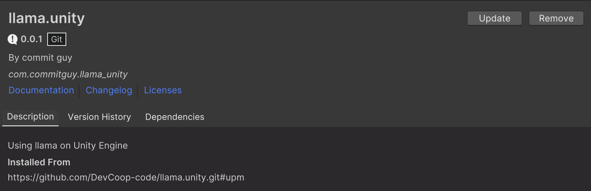
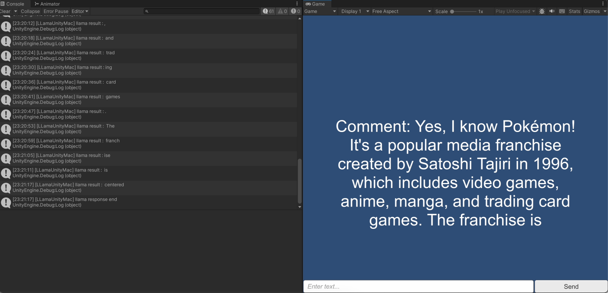

# llama.unity


llama.unity is a unity3d plugin to run llm model on your local device.

Based on [llama.cpp](https://github.com/ggerganov/llama.cpp).

it's convenient to use LLMs in your Unity Project

## Quick start
### Use UPM(Unity Package Manager)
1. In Unity, Window > PackageManager. Click "Add Package from git URL" and put on :
```
https://github.com/DevCoop-code/llama.unity.git#upm
```


## Demo
<table class="center">
    <tr style="line-height: 0">
    <td width="50%" height=30 style="border: none; text-align: center">llama-2-7b-chat</td>
    </tr>
    <tr>
    <td width="50%" style="border: none;"></td>
    </tr>
</table>